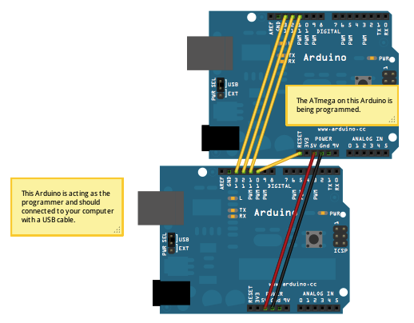

# Hướng Dẫn Nạp Chương Trình Arduino Bằng Một Arduino Khác (Thông qua SPI)
Trong bài này, mình sẽ hướng dẫn cách lập trình một Arduino bằng một Arduino khác — rất đơn giản, không cần cài thêm driver gì cả!
Phương pháp này cũng cực kỳ hữu ích nếu bạn cần nạp chương trình cho các bo mạch Arduino "giá rẻ" sản xuất tại Trung Quốc.
## Bước 1: Chuẩn Bị Dụng Cụ
Để bắt đầu, bạn cần chuẩn bị:
- 1 Arduino (dùng để lập trình, mình dùng UNO)
- 1 Arduino khác (là bo cần được lập trình, mình dùng NANO)
- Một ít dây nối
- Máy tính (để tải chương trình)
## Bước 2: Kết Nối Các Thiết Bị
Trước tiên, kết nối Arduino dùng để lập trình (UNO) với máy tính qua cáp USB.
Sau đó, dùng dây nối kết nối các chân giữa 2 Arduino với nhau theo sơ đồ:
- UNO pin 10 → NANO pin RESET
- UNO pin 11 → NANO pin 11
- UNO pin 12 → NANO pin 12
- UNO pin 13 → NANO pin 13
- UNO GND → NANO GND
- UNO 5V → NANO 5V

## Bước 3: Tải Chương Trình
Tiếp theo, mở Arduino IDE trên máy tính và làm theo các bước:
- Chọn đúng bo mạch đang dùng để lập trình (ví dụ UNO) bằng cách vào Tools > Board > Arduino UNO. Đồng thời chọn đúng cổng COM trong Tools > Port.
- Vào File > Examples > ArduinoISP và mở ví dụ ArduinoISP.
- Nhấn nút Upload để tải sketch ArduinoISP vào Arduino UNO.
- Sau khi tải xong, vào Tools > Board và chọn bo mạch mà bạn muốn lập trình (ví dụ Arduino NANO).
- Mở chương trình (sketch) bạn muốn nạp cho Arduino NANO.
- Vào Tools > Programmer và chọn Arduino as ISP.
- Cuối cùng, vào File > Upload Using Programmer để nạp chương trình.
Vậy là xong! Chương trình của bạn đã được nạp thành công lên Arduino cần lập trình.