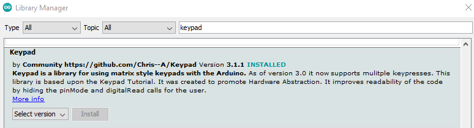

# Đọc Keypad 3x4 dùng ESP32
## Pinout
Các chân của keypad gồm 2 nhóm: hàng và cột.
Keypad 3x4 sẽ có (3+4=7 chân).

Sơ đồ keypad

## Cách thức hoạt động của keypad
Quá trình nhận biết phím được nhấn gọi là "scanning"  
Row-pins kết nối tới Output VĐK  
Column-pins kết nối tới Input VĐK (INPUT_PULLUP)  
***Quá trình Scanning:***
1. Đặt tất cả các row-pins ở mức HIGH
2. Cho 1 row-pin xuống mức LOW.
3. Đọc trạng thái của từng Cột:
- Nếu column-pin mức HIGH → phím (row, column) không được nhấn.
- Nếu column-pin mức LOW → phím (row, column) được nhấn.
## Thư viện

## Nối dây
0 - NC
1 - GPIO32
2 - GPIO33
3 - GIPO25
4 - GPIO26
5 - GPIO27
6 - GPIO14
7 - GPIO12
8 - NC
## Code
```c
#include <Keypad.h>

#define ROW_NUM     4 // four rows
#define COLUMN_NUM  3 // three columns

char keys[ROW_NUM][COLUMN_NUM] = {
  {'1', '2', '3'},
  {'4', '5', '6'},
  {'7', '8', '9'},
  {'*', '0', '#'}
};

byte pin_rows[ROW_NUM] = {33, 12, 14, 26 }; // GPIO18, GPIO5, GPIO17, GPIO16 connect to the row pins
byte pin_column[COLUMN_NUM] = {25, 32, 27};  // GPIO4, GPIO0, GPIO2 connect to the column pins

Keypad keypad = Keypad( makeKeymap(keys), pin_rows, pin_column, ROW_NUM, COLUMN_NUM );

void setup() {
  Serial.begin(9600);
}

void loop() {
  char key = keypad.getKey();
  if (key) {
    Serial.println(key);
  }
  delay(100);
}
```