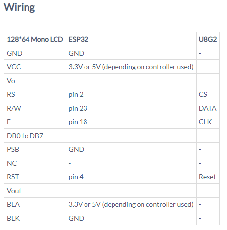
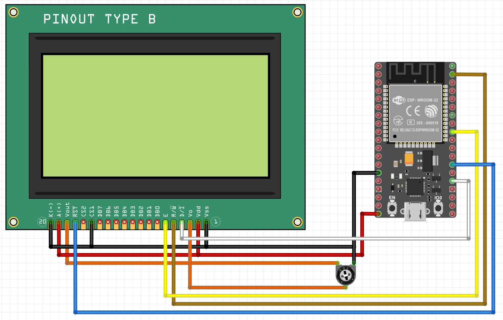
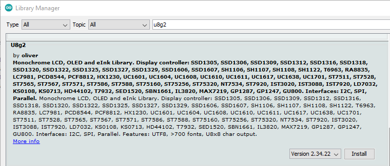

# Điều khiển LCD 12864 (ST7920) dùng ESP32
## Kết nối phần cứng


## Cài đặt thư viện

## Chạy code mẫu
Once you have installed the U8g2 library, go into examples and open "Examples/U8g2/full_buffer/GraphicsTest".
Tìm đoạn code sau (trong phần comment):
```c
U8G2_ST7920_128X64_F_SW_SPI u8g2(U8G2_R0, /* clock=*/ 13, /* data=*/ 11, /* CS=*/ 10, /* reset=*/ 8);
```
Viết lại thành đoạn code dưới đây để tương ứng với phần cứng:  
```c
U8G2_ST7920_128X64_F_SW_SPI u8g2(U8G2_R0, /* clock=*/ 18, /* data=*/ 23, /* cs=*/ 2, /* reset=*/ 4); //ESP32
```