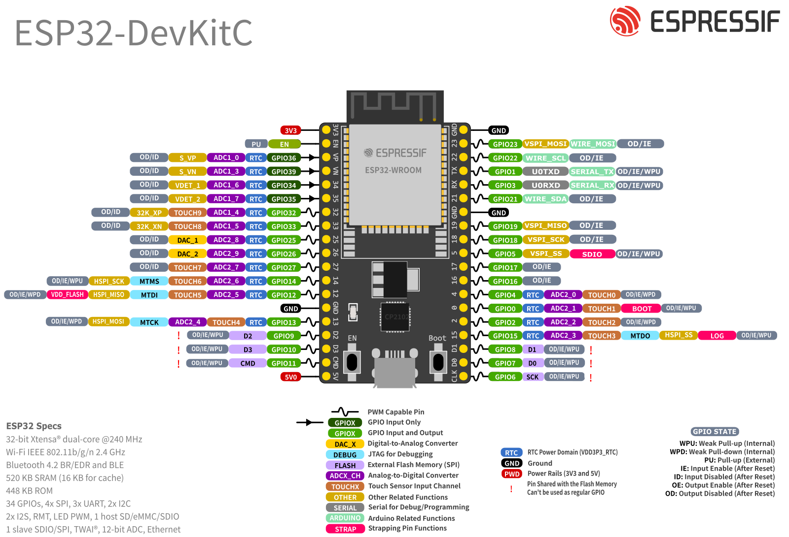

# Tổng quan về ESP32-DevKitC V4 Board
## Tổng quan
ESP32-DevKitC V4 là board được phát triển bởi Espressif dựa trên ESP32 với size nhỏ hơn.  
Có nhiều phiên bản của ESP32-DevKitC V4:  
For details please refer to ESP Product Selector.
## Mô tả chức năng
.

## Lựa chọn cấp nguồn

## Pin layout

## Chú ý
Không dùng ADC2 khi sử dụng wifi
## Nguồn tham khảo
[espressif](https://docs.espressif.com/projects/esp-dev-kits/en/latest/esp32/esp32-devkitc/user_guide.html).

---

# Môi trường lập trình - Arduino IDE
## Thiết lập
Cài đặt Arduino trên trang chủ.
Cài đặt bổ sung ESP32 board cho Arduino IDE. Mở Arduino IDE, chọn **File > Preferences**.  
Nhập *https://dl.espressif.com/dl/package_esp32_index.json* vào trường “Additional Board Manager URLs”.
Mở Boards Manager: **Tools > Board > Boards Manager**  
Tìm **ESP32** và nhấn cài đặt cho *“ESP32 by Espressif”*
## Cài Driver CP210x
Tải Folder Silicon-CP210 về máy và giải nén ra. Tải tại đây: [Drive_CP210x](https://drive.google.com/file/d/1CqX_7Nrs0TKGDvVl2h1h77daSS-M-jof/view)
Chạy file x64 dưới quyền admin.
## Chạy chương trình BlinkLED
Phần cứng

Thử một chương trình với ESP32. Tìm đến Example Blink của Arduino
Chọn Board là ESP32 Dev Module hoặc chọn DOIT ESP32 DEVKIT V1
Chọn Port và Upload chương trình.
## Nguồn tham khảo
[deviot](https://deviot.vn/tutorials/esp32.66047996/moi-truong-lap-trinh-esp32-va-nen-tang-arduino-ide.54524112) 
[esp32io](https://esp32io.com/tutorials/esp32-led-blink) 
