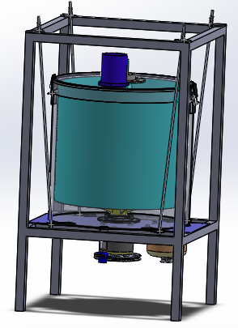
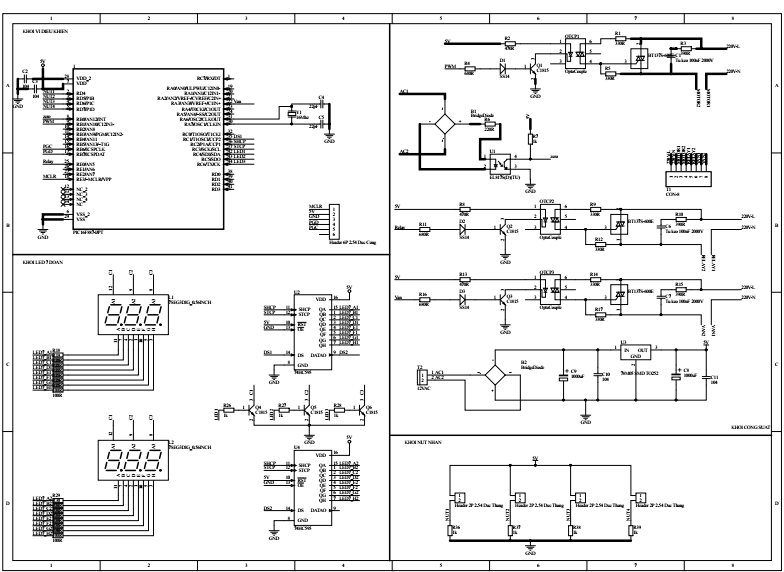
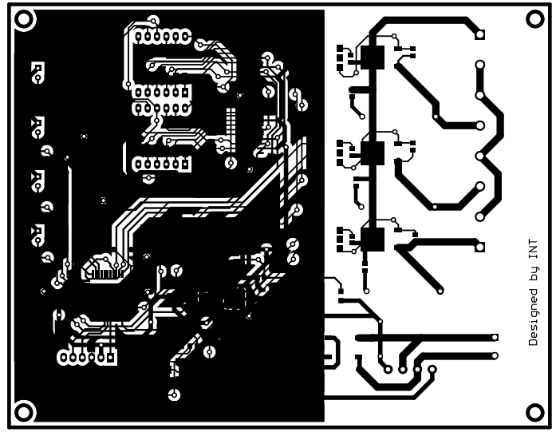

# Hệ thống bồn trộn li tâm sử dụng PIC16F887
Hình ảnh hệ thống

## Thiết kế PCB
PCB được thiết kế bằng phần mềm Altium.
Folder: ***PRJ_Wash***
Sơ đồ mạch của hệ thống:

Mạch PCB sau khi thiết kế

## Code
Sử dụng phần mềm MicroC for PIC để code
Folder: Centrifugal_system
## File 3D
Folder: Litam_sys.rar
